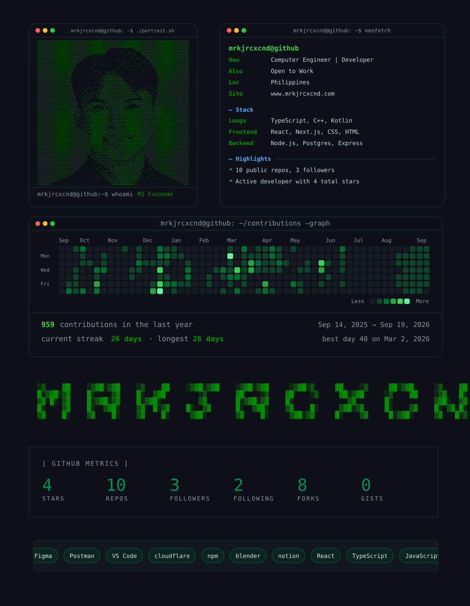

<!-- All profile artwork is rendered locally; the supplied screenshot is the visual reference. -->
<picture>
  <source media="(max-width: 600px)" srcset="./assets/profile-mobile.svg" />
  
</picture>

  <a href="https://www.mrkjrcxcnd.com">Portfolio</a> ·
  <a href="https://www.linkedin.com/in/kramikkk/">LinkedIn</a> ·
  <a href="https://www.youtube.com/@kramik-code">YouTube</a>

About me & profile details

I'm **MJ Exconde**, a **Computer Engineer | Developer** based in the **Philippines**, and I'm **open to work**.

| Area | Technologies |
| --- | --- |
| Languages | TypeScript, C++, Kotlin |
| Frontend | React, Next.js, CSS, HTML |
| Backend | Node.js, Postgres, Express |

The portrait, lettering, panels, and charts are stored in this repository. GitHub Actions refreshes the stats daily using GitHub's API. See [profile/README.md](./profile/README.md) to edit or regenerate the design.

